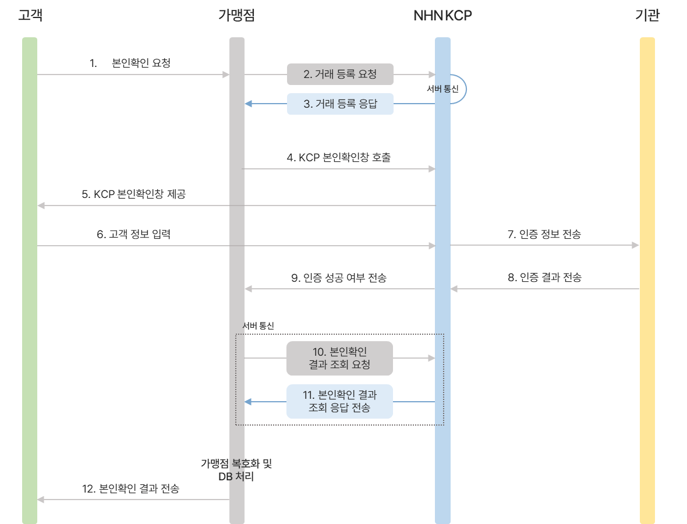

# KCP 본인인증 v2 마이그레이션

이번 작업은 처음에는 그냥 KCP 인증창 연동 방식만 바뀌는 줄 알았는데, 실제로 들어가 보니 인증창만 바꾸고 끝나는 작업은 아니였다.  
기존 v1에서 v2로 넘어가면서 프론트 호출 방식은 물론이고, 서버에서 거래를 등록하고 결과를 다시 조회하고 상태를 저장하는 흐름까지 같이 정리해야 했다.

## 요약

기존 v1은 HTML Form 파라미터를 실어서 페이지를 넘기는 방식이라 흐름이 비교적 단순했다.  
반면 v2는 REST API와 JS 라이브러리 기반으로 바뀌면서, 가맹점 서버가 중간에서 해줘야 하는 역할이 꽤 많아졌다.(약간 소셜로그인과 비슷하다. 기존 v1이 네이버/카카오, v2가 애플)

예전에는 앱에서 파라미터를 넘기고 인증창을 띄우는 느낌에 가까웠다면, 이번에는 서버가 먼저 거래를 등록하고, 필요한 키 검증을 하고, 인증 완료 후 결과 조회까지 다시 태워야 했다.  
즉 이번 작업은 단순히 본인인증 UI를 바꾸는 게 아니라, 본인인증 흐름 자체를 서버 중심으로 다시 정리하는 작업에 더 가까웠다.

> v1이 인증창을 호출하는 쪽에 가까웠다면, v2는 인증 요청의 상태를 서버에서 끝까지 들고 가는 구조에 더 가까웠다.

## v1 / v2 차이

위 플로우 이미지를 기준으로 보면, 이번 v2 방식은 인증창을 바로 띄우는 구조가 아니라 중간 단계가 꽤 많다.



> 이미지 흐름을 코드 관점으로 줄이면 `거래 등록 -> 인증창 호출 -> 인증 결과 수신 -> 결과 조회 -> DB 상태 업데이트` 순서로 볼 수 있었다.

1. 고객이 본인확인을 요청하면, 가맹점은 바로 인증창을 띄우지 않고 먼저 KCP에 거래 등록 요청을 보낸다.
2. KCP는 거래 등록 응답을 내려주고, 가맹점은 이 응답값을 기준으로 본인확인창을 호출한다.
3. 고객이 KCP 인증창에서 정보를 입력하면, KCP는 그 정보를 기관으로 넘겨 실제 인증을 진행한다.
4. 인증이 끝나면 성공 여부만 받고 끝나는 게 아니라, 가맹점 서버가 다시 KCP에 본인확인 결과 조회 요청을 보내 최종 응답을 받아야 한다.
5. 그 다음에야 가맹점 쪽에서 복호화나 DB 처리까지 마무리하고 최종 결과를 서비스에 반영할 수 있다.

이 흐름에서 개인적으로 제일 크게 느낀 건, v2는 "인증창 호출"보다 "인증 상태를 서버에서 어떻게 안전하게 관리하느냐"가 더 중요한 구조라는 점이였다.

요즘 트랜드 인 것 같다.

## 구현

### 거래 등록과 주문번호 생성

먼저 손본 부분은 거래 등록 단계였다.  
고객사 주문번호도 프론트에서 만드는 게 아니라 서버에서 생성해서 요청하도록 바꿨고, KCP에서 제공한 라이브러리 기준으로 암호화 방식도 최신 기준에 맞게 수정했다.  
이렇게 해두면 요청 단위를 서버에서 명확하게 관리할 수 있어서, 나중에 결과 조회나 DB 적재할 때도 이어붙이기가 훨씬 편했다.

여기서 `ordr_idxx`는 KCP에 넘기는 고객사 주문번호이면서, 우리 서버에서 인증 요청을 다시 찾는 기준값으로도 사용했다.  
그리고 거래 등록 응답으로 받은 `reg_cert_key`는 이후 본인확인 결과를 조회할 때 다시 필요하기 때문에, 요청 등록 시점에 DB에 같이 저장해두는 방식으로 잡았다.

실제 코드는 서비스마다 다르겠지만 느낌은 대략 이런 식이다.

```ts
const ordrIdxx = createOrderId();

const registerResult = await kcpClient.registerTransaction({
  siteCd,
  ordrIdxx,
  userName,
  userPhone,
  returnUrl: buildReturnUrl(ssrPath),
});

await certKcpRepository.insert({
  ordrIdxx,
  regCertKey: registerResult.regCertKey,
  status: "READY",
  email,
  regDate: new Date(),
});

return {
  ordrIdxx,
  regCertKey: registerResult.regCertKey,
  requestToken: registerResult.requestToken,
};
```

### iframe 구조는 유지하고 세션은 안 끊기게 수정

기존 화면 구조가 iframe 안에서 KCP 인증창을 띄우는 방식이었는데, 이 부분은 서비스 영향도를 줄이려고 그대로 유지했다.  
대신 인증창 도메인이 바뀌면서 세션이 꼬일 수 있는 부분이 생겨서, 세션 ID가 유지되도록 같이 수정했다.

겉보기에는 인증창만 바뀐 것처럼 보여도, 실제로는 도메인 변경 때문에 세션 처리 쪽을 신경 안 쓰면 인증 흐름이 중간에 깨질 수 있다.  
이번 작업하면서 이 부분이 생각보다 꽤 중요하다는 걸 느꼈다.

### 콜백 경로를 유연하게 받도록 변경

기존에는 callback path가 비교적 고정적인 느낌이었다면, 이번에는 `ssr path` 파라미터를 추가해서 콜백 위치를 조금 더 유연하게 받을 수 있게 바꿨다.  
나중에 인증 결과를 어느 경로에서 후처리할지 서비스별로 달라질 수 있어서, 그냥 하드코딩하는 것보다 훨씬 낫다고 느꼈다.

예를 들면 이런 식으로 콜백 URL을 조합해서 넘길 수 있었다.

```ts
function buildReturnUrl(ssrPath: string) {
  const baseUrl = process.env.APP_URL;
  const normalizedPath = ssrPath.startsWith("/") ? ssrPath : `/${ssrPath}`;

  return `${baseUrl}/api/kcp/callback?ssrPath=${encodeURIComponent(normalizedPath)}`;
}
```

## 서버에서 결과 조회를 한 번 더 하는 이유

또다른 중요 포인트 중 하나는, 인증 성공 알림이 왔다고 바로 끝내지 않는다는 점이였다.  
이미지 흐름에서도 중간에 성공 여부 전달이 있고, 그 뒤에 서버 통신으로 본인확인 결과 조회를 한 번 더 하는 단계가 있다.  
이 단계가 있어야 최종 응답을 기준으로 상태를 정리하고, 필요한 값을 DB에 안정적으로 저장할 수 있었다.

> 콜백으로 들어온 값만 보고 끝내기보다, 서버에서 결과 조회 API를 다시 호출해서 최종 상태를 확정하는 흐름으로 잡았다.

대략 이런 식으로 결과 조회 후 상태를 업데이트하는 구조를 생각했다.

```ts
const pendingCert = await certKcpRepository.findByOrdrIdxx(ordrIdxx);

const result = await kcpClient.queryVerificationResult({
  ordrIdxx,
  regCertKey: pendingCert.regCertKey,
});

await certKcpRepository.update(pendingCert.idx, {
  status: result.success ? "SUCCESS" : "FAIL",
  completedDate: new Date(),
});
```

개인적으로는 이 부분이 v2의 핵심이라고 느꼈다.  
그냥 인증창만 붙이는 게 아니라, 최종 결과를 서버에서 한 번 더 확인하고 상태를 확정하는 흐름이 들어오면서 전체 구조가 훨씬 백엔드 중심으로 바뀌었다.

## DB는 그냥 저장만 하면 끝이 아니였다

DB 처리도 생각보다 비중이 컸다.  
단순히 결과 한 번 받고 끝내는 게 아니라, `cert_kcp` 테이블을 따로 두고 인증 요청 자체를 추적할 수 있게 만들었다.  
이번 테이블은 `idx`, `ordr_idxx`, `reg_cert_key`, `status`, `email`, `reg_date`, `completed_date` 기준으로 구성했다.

각 컬럼은 대략 이런 의미로 잡았다.

- `idx`: 내부에서 사용하는 고유 식별자
- `ordr_idxx`: KCP에 넘기는 고객사 주문번호이자, 인증 요청을 다시 찾기 위한 기준값
- `reg_cert_key`: KCP 거래 등록 이후 내려오는 인증 키 값
- `status`: 인증 요청의 현재 상태
- `email`: 인증 요청과 서비스 사용자를 연결하기 위한 값
- `reg_date`: 인증 요청이 등록된 시간
- `completed_date`: 인증 결과 처리가 완료된 시간

이렇게 해두면 인증이 아직 진행 중인지, 성공했는지, 실패했는지, 결과 처리까지 끝났는지를 DB 기준으로 추적하기가 훨씬 편했다.

예를 들면 테이블 구조는 이런 느낌으로 가져가려고 했다.

```sql
CREATE TABLE cert_kcp (
  idx BIGINT NOT NULL AUTO_INCREMENT,
  ordr_idxx VARCHAR(100) NOT NULL,
  reg_cert_key VARCHAR(255) NOT NULL,
  status VARCHAR(20) NOT NULL,
  email VARCHAR(255) NOT NULL,
  reg_date DATETIME NOT NULL,
  completed_date DATETIME NULL,
  PRIMARY KEY (idx, reg_date)
)
PARTITION BY RANGE COLUMNS (reg_date) (
  PARTITION p20260609 VALUES LESS THAN ('2026-06-10')
);
```

그리고 인증성 데이터는 쌓이기 시작하면 생각보다 빨리 커질 수 있어서, 나중에 필요 없는 데이터가 계속 누적되는 상황도 같이 고려했다. 

그래서 `reg_date` 기준으로 하루 단위 파티션을 분리했다.  
처음에는 하나의 테이블에 계속 쌓아도 되지 않을까 싶었는데, 본인인증 요청은 서비스 사용량에 따라 매일 계속 들어오는 데이터라 시간이 지나면 조회나 삭제 비용이 커질 수밖에 없었다. 특히 인증 데이터는 오래 보관할 필요가 없는 데이터도 많아서, 나중에 한 번에 정리하려고 하면 운영 중 부담이 커질 수 있다고 봤다.

> 하루 단위 파티션으로 나누면 특정 날짜 데이터만 대상으로 조회하거나 정리하기가 편하고, 오래된 인증 데이터를 제거할 때도 훨씬 관리하기 좋아진다.

예를 들어 2026년 6월 9일에 등록된 인증 요청은 `p20260609` 파티션에 쌓이고, 다음 날 요청은 다음 날짜 파티션에 쌓이는 식이다.  
이렇게 나눠두면 배치에서 오래된 파티션을 기준으로 데이터를 정리하거나, 날짜별 처리량을 확인하기도 편해진다.

추가로 프로시저 호출 기반 배치 처리도 같이 설계했다.  
배치에서는 완료된 지 일정 시간이 지난 인증 요청이나, 오래된 미완료 요청을 정리하는 식으로 가져갈 수 있다.

```sql
CALL drop_old_cert_kcp_partitions(CURRENT_DATE);
```

당장 기능만 붙이면 빠르게 끝날 수는 있는데, 이런 데이터는 결국 운영 구간에서 정리 비용이 다시 돌아오기 때문에 처음부터 조금은 신경 쓰는 게 맞다고 느꼈다.

## 제일 오래 걸린 건 의외로 테스트였다

개인적으로 제일 시간 오래 쓴 부분은 세션 ID 관리랑 테스트 이슈였다.  
특히 테스트용 key로 PASS 앱 인증 테스트를 할 때 회원 이름이나 전화번호 같은 값이 비어 들어오는 문제가 있었는데, 처음에는 내가 연동을 잘못한 줄 알고 한참 헤맸다.

결과적으로는 테스트 환경에서 내려오는 데이터 특성과 내가 기대한 값이 서로 달라서 생긴 문제였고, 그 차이를 확인하고 맞추는 데 시간이 꽤 걸렸다.  
이런 건 문서만 볼 때는 잘 안 보이는데, 실제로 붙여보면 생각보다 시간을 많이 잡아먹는 부분인 것 같다.

## 마무리

정리하면 이번 작업은 단순한 버전 업그레이드라기보다, 본인인증 흐름을 프론트 중심에서 서버 중심으로 다시 정리하는 작업에 가까웠다.  
화면에서 보이는 변화는 크지 않을 수 있는데, 실제 내부에서는 거래 등록, 결과 조회, 세션 유지, 상태 관리, 배치 설계까지 꽤 많은 포인트가 같이 움직였다.  
그래서 생각보다 손도 많이 갔지만, 반대로 본인인증 흐름을 좀 더 구조적으로 이해하게 된 작업이기도 했다.   
추가적으로 홈페이지/앱 비밀번호 찾기, 회원가입 인증, 장치 마스터 변경 총 4개의 시나리오에서 적용해야돼서 매우 귀찮은 작업이였다. 